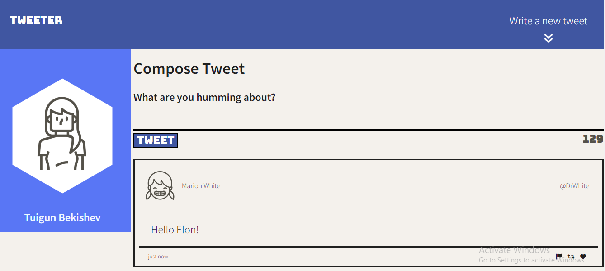
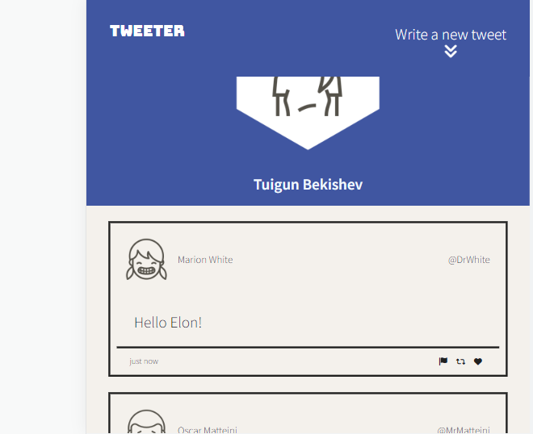

# Tweeter Project

This projects is AJAX based single-page Twitter clone that uses jQuery, HTML5, CSS and JavaScript. 

## Tweeter features:
- prevents code injection;
- responsive design;
- built-in on top button;
- finally it can tweet, of course in a local JSON file.

## Desktop Tweeter

## Mobile Tweeter

## Getting Started

1. [Create](https://docs.github.com/en/repositories/creating-and-managing-repositories/creating-a-repository-from-a-template) a new repository using this repository as a template.
2. Clone your repository onto your local device.
3. Install dependencies using the `npm install` command.
3. Start the web server using the `npm run local` command. The app will be served at <http://localhost:8080/>.
4. Go to <http://localhost:8080/> in your browser.

## Dependencies

- Express
- Node 5.10.x or above
